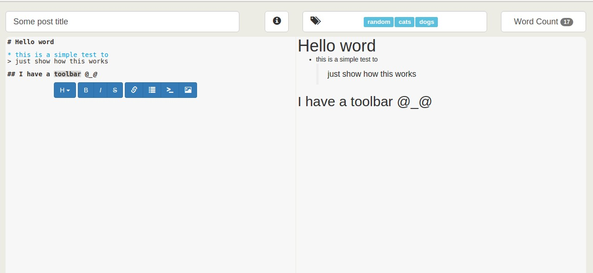

# AKASHA Markdown Editor
## Usage

Install this package with:
`meteor add akasha:markdown-editor`<br>
Then use it into your layouts or templates:
```
{{> markdown_editor}}
```

This package exposes a global object called `MarkdownEditor`. To access data from editor you can use:
 * `MarkdownEditor.getHtml()`
 * `MarkdownEditor.getTags()`
 * `MarkdownEditor.getMd()`
 * `MarkdownEditor.getPostTitle()`

[DEMO](http://akasha-markdown-editor.meteor.com)

 